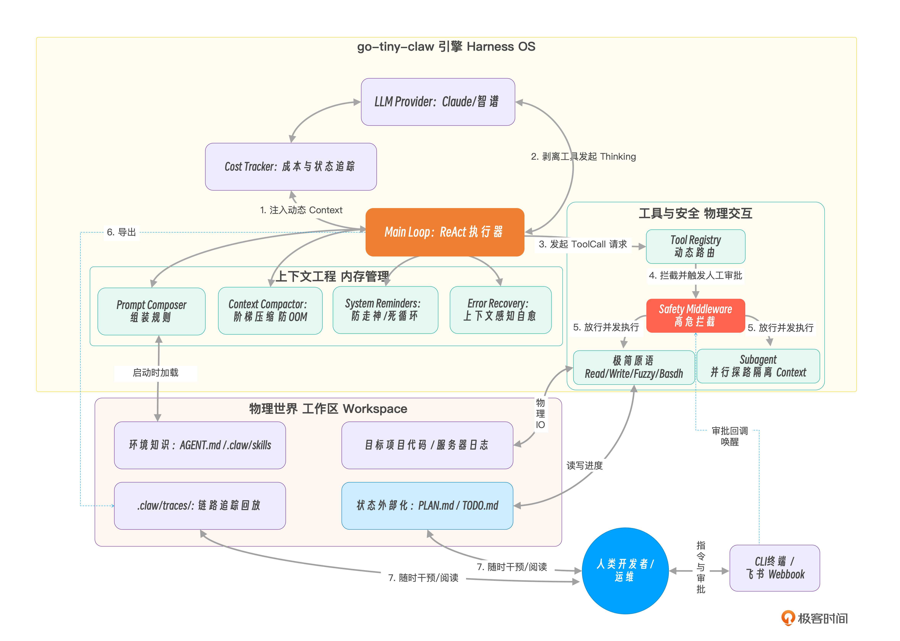

# 从 0 开始构建 Agent Harness

## 开篇词

Agent 开发的“三大失控摩擦力”：

- 上下文失控：我们盲目地给模型塞入几十个工具描述，却不知道大模型的注意力会被这些冗长的系统设定严重稀释，导致“降智”和幻觉。
- 状态失控：传统的框架在内存中维护着极其复杂的隐式状态机。一旦对话轮数过多，模型就会得“健忘症”；一旦遇到顽固报错，模型就会陷入死循环（Doom Loop）。而由于状态被框架封装在黑盒里，人类开发者根本无法在中途介入干预。
- 边界失控：我们既希望 Agent 拥有改变物理世界的能力（执行代码、修改文件），又缺乏底层的物理拦截机制。大模型的“冲动”一旦越界，就是灾难。

为模型提供健壮物理躯体和生存环境的底层引擎——这就是 Harness（驾驭工程）。

Harness 的本质，就是为大模型写一个微型操作系统（OS）。在这个 OS 里，大模型是 CPU，上下文窗口是极其珍贵的 RAM（内存），各种本地操作是外设（硬件）。Harness 不干涉 CPU 的计算，但它必须极其严苛地管理内存回收（上下文压缩）、调度硬件接口（极简工具集）、并随时准备触发系统中断（拦截高危操作与死循环）。

在拆解 OpenClaw 的源码时，我被它解决复杂工程问题时的“大道至简”深深折服：

1. 极简工具法则（Minimal Toolset）：当别人都在疯狂集成包含几十个 API 的臃肿 MCP 协议时，OpenClaw 坚信大模型本身足够聪明，因此只暴露 4 个完备的基础原语：Read、Write、Edit 和 Bash。只要给模型一个 bash，它就能自己去运行 git、grep，甚至自己写脚本来解决问题。这就从根源上消灭了工具层面带来的上下文膨胀。
2. 状态外部化（Externalized State）：这是 OpenClaw 的神来之笔。它完全抛弃了在代码内存中维护复杂的任务状态机。相反，它强制 Agent 将数据写在工作区的 Markdown 文件中，比如将宏大的规划写在 PLAN.md 中，将微观的进度写在 TODO.md 中。记忆不再是黑盒，而是人类随时可以打开、阅读甚至手动修改的纯文本。这实现了真正的“零成本人机协同”。
3. YOLO 哲学与防御纵深：在本地开发环境，它奉行 YOLO（You Only Live Once，全权信任）模式，让 Agent 自由狂奔；但同时，它又在底层埋下了坚固的安全中间件（Middleware），用于在部署到远端服务器时，瞬间挂起高危命令，等待人类的审批放行。

架构分层解析

- 入口交互层：引擎对外的触角。我们将支持终端命令行（CLI）输入，并将其接入飞书。更重要的是，这一层包含了人工审批（Human-in-the-loop）的异步回调机制。
- 核心引擎层（心脏）：系统的控制中枢。Main Loop 负责维持 ReAct 循环。旁边的大模型适配器是“大脑接口”，抹平不同大模型（如 Claude 和 OpenAI 兼容）底层 API 的差异。新增的 Thinking 模块则负责在行动前强制模型进行慢思考。
- 上下文工程层（内存管理器）：决定 Agent 能够跑多远的关键。
  - a. Prompt 动态组装器：动态拼装模块化的系统规则（如读取 AGENTS.md）。
  - b. Token 监控与阶梯压缩器：像 OS 的内存回收器一样，时刻盯着 Token 水位线触发压缩。
  - c. 运行时事件提醒注入：是防走神的利器，在模型做决定的前一刻注入干预指令。 基于文件系统的状态与记忆则是极简哲学的核心——抛弃内部变量，直接把进度写在本地 TODO.md 里。
- 工具与执行层（四肢与手脚）：挂载了让模型改变物理世界的组件。动态的 ToolRegistry 配合极简工具集（read/write/edit/bash），让模型组合出无限可能。强大的 Middleware 机制则死死把守大门，拦截危险命令并对接审批。

## 手写 Agent 的 Main Loop

在顶级引擎（如 Claude Code、OpenClaw）中，这个 Main Loop 的设计有几个极其鲜明的特征：

- 极度纯粹，没有预设分支：循环中没有业务逻辑，全凭模型决定走向。
- 不设硬性的最大步骤限制：传统的玩具框架喜欢设置 max_turns=10，但真实的工业任务可能需要 50 步。顶级引擎不在此处做生硬的截断，而是依赖后续我们将会讲到的 Context Compaction（内存压缩） 和 System Reminders（系统级防死循环干预）来维持稳定。
- 上下文（Context）是唯一的记忆载体：在这个循环中，数据会像滚雪球一样不断累加，记录下每一次的思考、动作和观察结果。

## 慢思考与自省：在 ReAct 循环中剥离独立的 Thinking 阶段

两阶段 ReAct（Two-Stage ReAct）

架构重构:

- 洞察模型的“冲动”陷阱：我们从理论上揭示了当工具 Schema 存在于请求上下文中时，大模型（作为系统 1）天生倾向于立刻采取行动，而忽视全局规划。提示词层面的约束对此收效甚微。
- 两阶段 ReAct（Two-Stage ReAct）：借鉴业界顶级框架的实践，我们在代码层面上强制将 Thinking 和 Action 物理拆分。
- 驾驭工程的四两拨千斤：在具体实现时，我们通过在第一次调用 Provider 时传入 availableTools = nil，极其优雅地“逼迫”大模型输出纯文本的思考轨迹（Thinking Trace），并将其固化为接下来的上下文，利用其自回归特性引导精准的行动。

## 动作延伸：构建强扩展性的 Tool Registry 与分发机制

Tool Registry 扮演了一个极其关键的“集线器（Hub）”和“路由器（Router）”的角色。它的核心职责有三：

1. 动态挂载（Register）：允许开发者在引擎启动时，随时随地向系统插拔新的工具实现（在 Go 中，其本质上是实现了特定 Go 接口的结构体）。
2. 描述暴露（Expose Schema）：在每次向大模型发起推理前，Registry 负责把当前所有已挂载工具的名称、描述以及 JSON Schema 打包成列表，交给 Provider 翻译给大模型听。
3. 路由分发与执行（Dispatch & Execute）：当大模型决定调用某个工具，并吐出一串 JSON 参数（ToolCall）时，Registry 负责找到对应的 Go 函数，把 JSON 丢给它执行，最后将结果封装成统一的 ToolResult 返回给 Main Loop。

## 大道至简：解密 OpenClaw 最简工具集法则与 YOLO 执行哲学

极简主义与 YOLO（You Only Live Once）模式。

大模型的每一次思考（每一次 Turn 发起请求时），都必须把这些极其冗长的工具描述（JSON Schema）全部阅读一遍。这在业界被称为 Context Bloat（上下文膨胀）。

这会带来三个致命的后果：

1. 极高的成本与延迟：仅仅为了问一句“帮我看看 main.go 的代码”，你就要向大模型发送 3 万个 Token 的前置工具描述。每次 API 请求的时间和金钱成本呈指数级上升。
2. 注意力分散：这是最致命的。大模型的核心机制是注意力（Attention）。工具描述越多，大模型对核心任务指令的注意力就越弱。它非常容易发生幻觉（Hallucination），在几十个长得差不多的工具中调用了错误的那一个。
3. 无尽的适配维护：你每加一个特定的专用工具（比如 search_jira_ticket），就要在 Go 引擎里维护一套繁琐的反序列化和 API 请求代码。一旦第三方接口变更，Agent 直接罢工。

在 OpenClaw / pi 的极简哲学中，仅需为大模型提供 4 个基础工具：

- read：读取文件内容（获取环境信息）。
- write：创建新文件或完全覆盖文件。
- edit：精准的局部代码替换（外科手术式修改。由于其具备多级降级的复杂性，我们将在下一讲专门实现）。
- bash：在当前工作区执行任意 Shell 命令（终极执行器）。

在基础开发阶段，OpenClaw 奉行 YOLO 模式：默认全权信任，直接在工作区（WorkDir）中执行。如果真的出了错，交给 Git 去回滚。

# 07｜容错艺术：实现支持多级模糊匹配的稳健 Edit 工具

格式幻觉

## 降级策略：多级模糊匹配链（Chain of Responsibility）

在这套多级匹配的管道线中：

- 级别 1：最快最安全的精确匹配。
- 级别 2：解决不同操作系统（Windows vs Unix）换行符导致的幻觉。
- 级别 3：忽略整个代码块首尾的多余空行。
- 级别 4（核心容错）：将 old_text 和原始文件都按行切分，去掉每一行的首尾空格（消除缩进差异），然后再进行比对。

最关键的安全底线是**“唯一性校验”**：模糊匹配可能会导致匹配到代码里多个相似的片段。如果匹配结果 > 1，工具绝对不能盲目替换，而是必须抛出错误，要求大模型提供更多的上下行代码以精确定位。

## 08｜并发提效：如何让 Agent 在单轮中并行调用多个互相独立的工具？

业界顶级 Harness（如 OpenClaw / Claude Code 内部逻辑）的做法是基于一个强有力的独立性假设：

如果大模型在同一个 Turn（单次 Response）中并行下发了多个工具调用，Harness 引擎必须假设这些调用是互不依赖、互相独立的。引擎应当无脑并行执行它们。 为什么？因为大模型在经过大量 RLHF（基于人类反馈的强化学习）微调后，它非常清楚：如果有强先后依赖的操作，必须分两个 Turn 来完成。

YOLO（全权信任）与自纠错（Self-Correction）哲学：错误的原样回传，会让模型在下一轮自己吸取教训，改为分步执行。

## 架构演进：从串行到并发（Fork-Join 模式）

我们要将 Main Loop 中的工具分发环节，重构为经典的 Fork-Join（分支 - 聚合）模式。

### 解决数据竞争

一个可行的思路是在 Registry 层面引入一种“基于文件路径的细粒度锁（File-Path based Mutex）”策略，使用 sync.Map 为每个文件路径维护一把独立的 RWMutex。前提是所有协程必须严格遵守“先获锁，后操作文件”的规范，RWMutex 才能将并发的文件 I/O 序列化，从而消除 Data Race。

一个更健壮的 Harness 并发策略可以是：由 Harness 引擎（而非模型本身）在分发 ToolCall 批次时，检查本批次是否全部为只读工具调用。若是，则启用并发 Goroutine；若批次中存在任何写操作，则退化为顺序执行。这种“只读并发、涉写串行”的策略，以极低的复杂度，在绝大多数场景下同时保证了性能与正确性。

## 提示词组装：告别面条代码，动态加载 AGENTS.md 与外挂 Skills

System Prompt 被视为大模型运行时的操作系统内核（Kernel），它必须是模块化“编译”和“动态链接”的

顶级引擎（如 OpenClaw）给出了一个极其优雅的分层加载策略：

1. 极简内核（Minimal Core）：引擎代码里只硬编码最基础的身份认知、交互模式，通常不到 1000 Tokens。
2. 工作区守则（AGENTS.md）：状态外部化。引擎会去读取用户工作区根目录下的 AGENTS.md 文件。这个文件由人类维护，声明当前项目的专属架构和规范。
3. 技能外挂（Skills）：特定领域的知识包（SOP）。它们以独立的目录和文件形式存在，按需提供给智能体。

渐进式暴露（Progressive Disclosure）”的上下文管理哲学：

在引擎启动时（Discovery 阶段），Harness 可以只解析 YAML 头部，将 name 和 description 告诉大模型。只有当大模型明确判定当前任务需要该技能时，再去加载完整的 Markdown 正文（Activation 阶段）。这极大地节省了 Context 内存！

## 11｜会话管理：Session 物理隔离与 Working Memory 的底层实现

多端并发场景下的 Session（会话）物理隔离。

## 12｜突破内存：基于阶梯降级的 Context Compaction 策略

如果大模型是 CPU，那么 Context Window（上下文窗口）就是极其昂贵且容量受限的 RAM（内存）。物理防御（防止内存溢出 OOM）的优先级，永远高于业务逻辑（短期记忆的完整性）。

处理内存压力必须采用“阶梯降级（Staged Degradation）”策略。我们的目标是：丢弃冗余的数据（释放物理内存），但死死保住意图和逻辑链。

**一种解法：Observation Masking 与 Head-Tail Truncation **

这一讲，针对 go-tiny-claw 遵循的极简主义哲学，我们不会引入另一个大模型专门做“对话摘要”。我们采用一种极其轻量但高效的字符级截断策略。

我们可以将需要压缩的上下文消息，根据其在对话中的“距离”，施加不同级别的“降级魔法”：

- System Prompt（系统提示）：永远保留，神圣不可侵犯。
- 远期历史：超出 Working Memory 保护区的早期对话。在这里，大模型的 ToolCall（调用了什么工具、传了什么参数）必须保留以维持逻辑链，但是工具执行的返回结果（往往几千字）将被彻底掩码替换（Masking），比如变成一句话：“…[为了节省内存，早期的工具输出已被系统清理。原始长度: 15000 字节]…”。
- Working Memory（短期工作记忆）：最近的N轮对话。我们期望它是完整的。但如果其中单条工具输出实在太长（比如超过了 1000 字符），哪怕它处于保护区内，我们也必须触发掐头去尾截断法（Head-Tail Truncation），仅保留前 500 字和后 500 字。因为对于报错日志来说，开头说明了错因，结尾通常带有堆栈总结，中间的无尽循环完全可以抛弃。

顶级开源项目和闭源商业产品通常会采用更复杂的混合策略：

1. 大模型摘要压缩（LLM-based Summarization）：这是最经典的做法。当历史记录逼近水位线时，后台会异步调用一次成本较低的模型（可以是同系列的轻量版，或主力模型的低价 API 调用），将过去的几十条记录浓缩为一份几百字的“剧情提要”，并用它替换掉原来的长历史。这能最大限度地保留关键语义，但缺点是增加了 API 成本和延迟，且摘要模型本身可能产生“幻觉遗漏”。
2. 自适应检索增强（Agent Memory / Memory Paging）：借鉴操作系统的虚拟内存分页机制。Agent 会将长历史日志分块灌入本地的向量数据库（Vector DB），上下文里只保留摘要。当大模型在后续推理中需要查看细节时，主动调用类似 search_memory 的工具将相关片段“换入”上下文。
3. 大语言模型原生进化（Long Context Models）：随着模型底座能力的飙升，支持的上下文窗口进一步增大，“大力出奇迹”正在成为可能。未来，我们或许不再需要写复杂的 Compactor，而是直接将几个 G 的日志全量扔给模型。但就目前的 API 计费模式而言，这依然是土豪的专属玩法。

## 13｜记忆沉淀：状态外部化，基于文件系统的持久化记忆与待办管理

状态外部化：把复杂的状态机变成肉眼可见的 Markdown

一切长程任务的追踪都可以通过引导 Agent 读写两个约定俗成的文件来完成：
PLAN.md：用于存放宏大的架构设计、重构思路和全局约束。
TODO.md：用于存放细颗粒度的待办事项列表（Checklist）和当前进度状态。

这种重型的记忆管理机制通常是一个可选的“计划模式（Plan Mode）”。简单的任务没必要

在驾驭工程和学术界实践中，工业级 Agent 的记忆（Memory）通常被设计为严密的多层体系（Multi-tiered Memory System）：

1. 短期工作记忆（Working Memory）：也就是我们在第 11 讲实现的 GetWorkingMemory()。它只保留最近 N 轮的会话消息，保证当前 API 请求不会 OOM。这是模型思考的“草稿纸”。
2. 任务级状态记忆（State Memory）：也就是本讲中的 PLAN.md 和 TODO.md。它伴随当前具体任务的生灭，任务结束后即被归档。这是模型的任务看板。
3. 情景记忆沉淀池（Episodic Memory）： 在 OpenClaw 的底层实现中，引擎会在工作区（默认 ~/.openclaw/workspace）的 memory/ 目录下，按日期自动生成如 2026-04-12.md 的 Markdown 日志文件，同时维护一份汇总长期事实、偏好和关键决策的 MEMORY.md。每当上下文即将被 Compaction（压缩）之前，OpenClaw 会自动触发一个静默轮次，将当前会话中尚未落盘的重要信息写入记忆文件，防止上下文丢失。此外，还有可选的 Dreaming（实验性）后台机制，它会对短期记忆信号进行评分，并将高质量条目晋升至长期记忆 MEMORY.md。
4. 长程记忆检索（Hybrid Retrieval）： 当用户提出跨越周期的历史性问题时，Agent 会自动调用 memory_search 工具，从上述的情景记忆沉淀池中大海捞针，精准提取过去的经验，再拼接回当前的 Working Memory 中。其底层采用混合检索（Hybrid Search）策略——同时运行向量搜索（语义相似性，用于理解近义表达）和 BM25 关键词搜索（用于精确匹配 ID、错误字符串、配置键名等），并将两路结果合并排序。Embedding 向量由 OpenAI、Gemini、Voyage、Mistral 等提供商生成，开箱即用；也可使用本地模型实现完全离线的语义检索。

这也是 OpenClaw 等框架令人印象深刻的地方：它将记忆存储降维为本地 Markdown 文件的“追加写入（Append）”，同时以内置 SQLite 向量索引支撑"混合语义检索（Hybrid Search），在极简部署成本与强大检索能力之间取得了平衡。

## 14｜错误自愈：上下文感知的 Error Recovery 提示模板注入机制

上下文感知的 Error Recovery（错误自愈）提示模板注入：

当工具报错时候，我们根据报错类型，加入合适的提示词。目前使用的是根据工具预写死的提示词。
如果是未知的错误，可以用小模型，总结错误并写入上下文

## 15｜行为干预：防止 Agent 陷入“死循环”的 System Reminders 机制

Doom Loop（死循环）或者 Exploration Spiral（探索螺旋）。

System Reminders（运行时动态提醒机制），

导致死循环的真正原因，是驾驭工程中极具挑战性的两个大模型行为陷阱：

1. 上下文内容分布偏移：当模型连续几次遇到同一个棘手的 Error 时，上下文末尾会堆积大量结构相似的错误信息（ToolResult）。这些高度重复的 token 在内容分布上占据了绝对主导，使得模型的下一步生成被这些近期输入强力牵引，表现出“只想解决眼前报错”的行为倾向。这并非注意力机制本身发生了结构性故障，而是输入内容的分布决定了输出的走向。
2. 近因偏差（Recency Bias）：这一现象在学术上有实证支撑——研究表明，当关键信息位于长上下文的头部或中部时，模型对其的响应权重会显著低于位于上下文末尾的信息（即 Lost in the Middle 效应）。相比于写在上下文最顶端、长达数千字的、泛泛而谈的系统规则，模型更倾向于对距离它最近的输入（即刚刚返回的那个 ToolResult 报错信息）做出强烈反应。

### System Reminders 的破局之道

即将发起下一次 LLM 推理调用的地方，将高优先级的引导指令伪装成最新的一条 User Message，直接怼到它的脸上！

Doom Loop Detection（死循环检测），即模型连续多次使用了完全相同的参数特征调用了同一个工具，并且都失败了。

大模型“走神”与死胡同。 认知的突破：

1. 距离产生遗忘：System Prompt 并不是万能的，它防不住大模型在长程任务中产生的“局部执念”。真正能强行扭转模型当下一言一行的，是距离它最近的那条上下文消息（Recency Bias）。
2. 化被动为主动：与其祈祷模型自己想通，不如主动出击。我们在大模型每一次重新思考前夕，设计了一个“事件探测器”，分析过往日志的异常特征，并在必要时模拟人类的口吻，强行终止错误路径。
3. 优雅的解耦设计：我们的 Main Loop 依旧保持清爽。通过抽象出 ReminderInjector 并把它挂载在每个 Turn 的尾部，我们将复杂的防呆逻辑安全地隔离在了引擎的主控流之外。

## 16｜防御纵深：利用 Middleware 实现高危命令拦截与飞书人工审批

**Human-in-the-loop **其实是一种把“人工判断 / 决策”融入到自动化 / 算法流程里的做法。即系统先做一部分决策或生成结果，但关键环节需要人类介入（审核、修正、确认、或提供反馈），再决定下一步。

### Middleware 拦截与协程挂起

优秀的 Harness 引擎采用了 Middleware/ Hook 模式。

1. 统一拦截点：在 Registry 接收到大模型的 ToolCall 请求后，但在真正调用底层 tool.Execute() 之前。
2. 审批通道：当检测到高危操作（如 bash 匹配到了 rm、sudo 等黑名单正则）时，Middleware 会阻塞当前的执行协程。
3. Human-in-the-loop：通过第 9 讲建立的 Reporter 通道，向飞书发送一张包含“同意”和“拒绝”指令的交互信息。
4. 放行或阻断：人类在飞书上确认回复后，触发 Webhook 回调，通过 Go 的 channel 发送信号解除阻塞。同意则继续执行；拒绝则直接向模型返回“人类拒绝执行”的报错。

## 17｜任务委派：引入 Subagent 隔离复杂探索任务的上下文瓶颈

在 Harness 驾驭工程中，突破单体大模型能力天花板的解法，就是向现代企业管理学习：任务委派（Delegation）与多智能体（Multi-Agent / Subagent）架构。

通过实现一个特殊的工具，让主 Agent 能够根据需要，随时随地拉起一个受限隔离的“子智能体（Subagent）”去帮它干脏活累活！

编写一个名为 spawn_subagent 的特殊工具，它的执行逻辑就是：新建一个 AgentEngine，传入一个纯净的 Session，然后阻塞等待这个子 Engine 跑完，最后把输出作为 ToolResult 返回。

这里是把子 agent 当做一个工具去创建，而不是维护图等。

### Subagent 的前沿形态与 Team 协作模式

我们实现的是一种极其轻量的父子委派（Delegate-and-Return）模型。主 Agent 拉起子智能体，死死阻塞等待，子智能体干完活后丢回一个字符串总结，随即销毁。

多智能体协作已经演化出了极其复杂的社会化形态:

1. 黑板架构（Blackboard Architecture）与共享任务列表

在前沿的 Team 模式中，主 Agent 不再是死等。系统会分配一个全局共享任务列表（Shared Task Board）。主 Agent（如架构师）把大拆解后的子任务写入任务列表，多个具备不同专长（如前端、后端、DBA）的子智能体像“消息订阅者”一样，各自认领任务并并行工作。它们的工作进度会实时更新在任务列表上，主 Agent 可以随时查阅并下发新的指令。Claude Code Agent Teams 已在工程层面实现了这一模式的原生支持。

2. 点对点协商（P2P Negotiation）与依赖挂起

当前端子智能体发现自己缺少后端的 API 接口时，它不需要层层上报给主 Agent。它可以直接向后端子智能体发起 Peer-to-Peer 请求：“老兄，帮我补个 /user 接口”。此时，前端子智能体的协程将被挂起，直到后端子智能体完成了代码编写并返回 Event Signal，它才会被唤醒继续干活。这就要求引擎底部拥有极强的协程调度器（Coroutine Scheduler）。

3. 群体辩论与一致性投票

在某些极度敏感的场景（如线上核心代码 Review），Harness 引擎会同时拉起 3 个不同大模型（比如 Claude Sonnet、GPT-5.x、Gemini 系列）驱动的 Reviewer Subagent。这三个子智能体会先分别输出 Review 意见，然后互相审查对方的意见，直到达成多数票共识，才会将最终报告反馈给人类。这极大地消除了单一模型的幻觉。

## 18｜成本与状态追踪：在 Harness 层拦截并记录 Token 消耗与执行耗时

工业中可以使用 langsmith

这里手动实现

## 19｜洞察黑盒：为 Agent 引入 Tracing 机制复盘失败决策路径

一个完整的 Agent 运行周期，天然具备一棵极度工整的树状结构：

1. Root Span（根跨度）：代表一次完整的 Run 任务。
2. Child Spans（子跨度）：代表 ReAct 循环中的每一个 Turn。
3. Leaf Spans（叶子节点）：代表每一个 Turn 内部的细分操作，例如 Generate（LLM 调用）、Execute（工具执行）、Compaction（内存压缩）。

## 如何评估一个 Agent 的好坏？

目前业界公认的最权威的 Coding Agent AI System 评测集是 SWE-bench，它源自普林斯顿大学的研究，通过爬取 12 个流行开源 Python 仓库的 Issue 与 Pull Request，构建了 2294 个真实软件工程任务（截止至发文时）。其评估核心逻辑可以凝练为四个字：基于测试（Test-Driven Evaluation）。

在驾驭工程中，我们不需要引入庞大的 SWE-bench 环境，但我们可以借鉴它的核心评估范式，我们同样以程序员最熟悉的修正 bug 的场景为例：

- 准备靶机（Testbed）：提供一个有明确 Bug 的代码库。 设定指令（Prompt）：告诉 Agent 有什么现象（比如运行 main.go 时抛出了空指针异常），让 Agent 自己去改。
- 客观断言（Assertion）：Agent 说自己改好了不算数。我们通过执行一段验证脚本（比如 go test），来判断 Agent 是否真的让原本失败的测试变为通过，且没有破坏其他测试——这正是 SWE-bench Fail-to-Pass 范式的精髓。
- 计算综合得分：结合我们在第 18、19 讲收集到的成本（Cost）、耗时（Duration）和轮数（Turns），给这次任务打一个综合分数。

### 业界前沿：AI Agent 评估方法论全景

1. 结果评估（Outcome-Based）vs 轨迹评估（Trajectory-Based）

结果评估只看最终答案对不对，类似于“考试只看最终分数”。SWE-bench 的 pass/fail 就是典型的结果评估，简单客观，易于自动化。

轨迹评估则关注 Agent 走过的每一步是否合理。它会比对 Agent 实际执行的工具调用序列与标准答案中期望的序列是否一致。轨迹层面的指标能够暴露推理过程中的失败，而结果层面的指标只能验证任务是否完成。举个例子：两个 Agent 都修好了 Bug，但一个走了 3 步、另一个走了 20 步，仅看结果你无从区分优劣，只有轨迹评估才能发现这种效率差距。

2. LLM-as-Judge 与 Agent-as-Judge

对于那些没有标准答案的开放性任务（如帮我重构这段代码的可读性），测试脚本无法判断对错，于是出现了用 LLM 来评判 LLM 的范式。 Agent-as-Judge 框架则将这一思路延伸到了自主 Agent 领域。它提出用一个“裁判 Agent”来评估另一个“选手 Agent”，从而实现对完整轨迹的评估，而不仅仅是最终结果。在实践中，“多 Agent 裁判”范式会让多个具备不同视角的 LLM Agent 同时担任评委，模拟多维度的人类判断，以提升评估结论的可靠性。

3. 子目标完成率

复杂任务往往不是一个简单的 pass/fail 可以衡量的。业界越来越多地采用分解子目标的方式：将一个大任务拆分为若干可独立验证的子步骤，分别打分，再加权求和。主流评估引擎会在多个粒度上同时计算指标：最终成功率、子目标完成情况、延迟、成本以及工具调用准确率。这种方式既能给出整体得分，也能精确定位 Agent 在哪个环节掉链子。

4. 持续评估与防过拟合

当所有人都在同一个静态 Benchmark 上“卷”时，模型很容易通过记忆测试集来“虚假刷分”，而非真正具备解题能力。SWE-bench-Live 应运而生，它是一个可持续更新的动态评测集，任务全部来源于 2024 年以后产生的真实 GitHub Issue，以此规避数据污染和过拟合风险。这种“动态 Benchmark”的思路，持续引入新数据、让模型无法背答案，正在成为业界共识。

5. 与 CI/CD 流水线集成

将评估嵌入 CI/CD 流水线，已经成为让 Agent 真正走向生产可信的基础设施。每一次 Prompt 模板变更、工具函数修改或模型版本升级，都自动触发一次 Benchmark 跑分，并对比历史基线，才能真正做到"每次改动心中有数"

## 21｜实战串讲（上）：拼装完整 CLI 引擎，完成未知项目的文件探索与重构

支持在命令行，输入 workdir, 选择 mode， 等参数

## 22｜实战串讲（下）：打造 AgentOps 小助手，在飞书中触发日志分析与故障修复审批

在工业级的 Harness Engineering（驾驭工程）中，ChatOps（对话驱动运维）+ Human-in-the-loop（人工审批拦截） 才是很多 Agent 的落地形态。

## 结束语｜Agent 的尽头是 OS，大模型时代开发者的驾驭新征程

