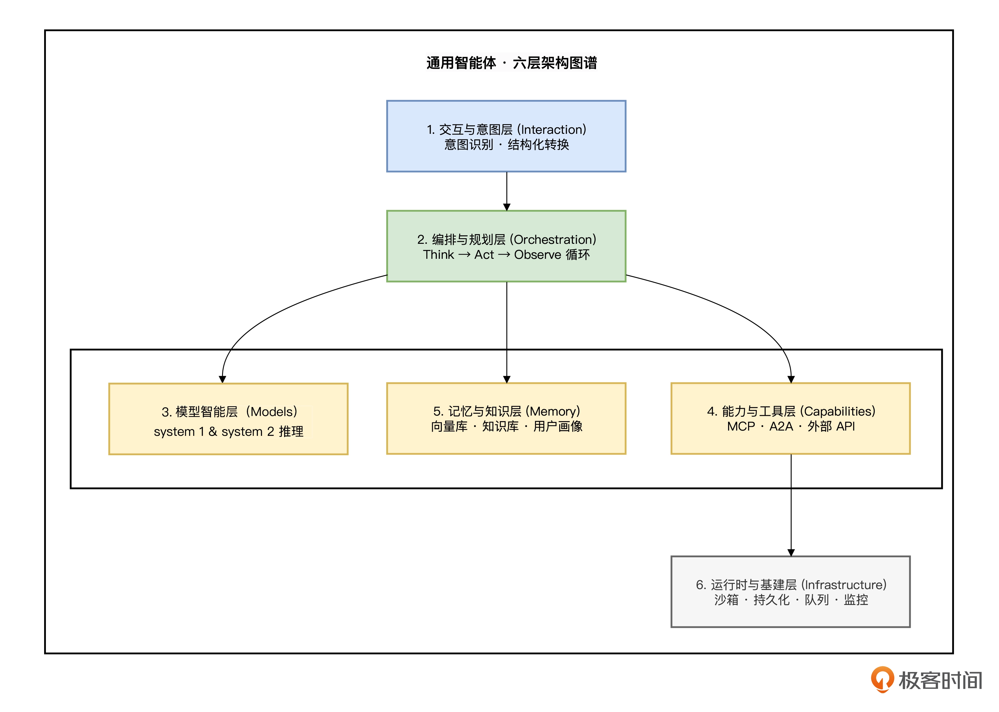
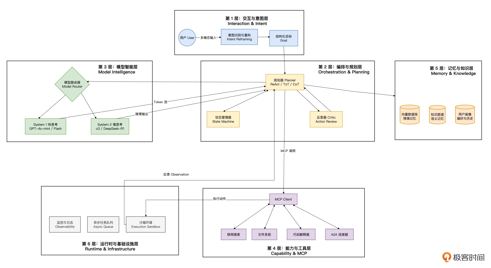

# 通用智能体设计架构（General Agent Architecture）

Agent（智能体） 的本质，可以用一个核心词概括：Agency（自主权 / 代理权）

一个真正的 Agent，必须具备人类解决问题的三个核心特征，缺一不可。

- 自主思考（Autonomous Reasoning）：它不是被动地回答“是什么”，而是主动地构思“怎么做”。它能自己拆解目标，通过 Chain of Thought（思维链）构建策略。
- 行动能力（Action Capability）：它有手有脚。它能通过 MCP 协议操作文件、控制浏览器、调用 API。它不仅仅是建议者，更是执行者。
- 在行动中学习（Learning by Doing）：这是一个闭环，Think（思考） → Act（行动） → Observe（观察） → Improve（修正）。它能感知行动的结果（比如报错、网页结构变化），并根据反馈调整下一步策略。

## 核心哲学：零预定义工作流（Zero Predefined Workflow）

零预定义工作流。 我们要抛弃人工编排的“逻辑树”，转而构建一个巨大的自主循环（Autonomous Loop）

在这个循环中，系统的职责不再是规定“下一步做什么”，而是提供：

- 丰富的工具箱（MCP）。
- 稳定的执行环境（Runtime）。
- 清晰的长期记忆（Memory）。
- 实时的反馈通道（Observation）。

而“下一步做什么”，完全交给模型（如 OpenAI o3、DeepSeek R1 或 Gemini 3.0）的推理能力去动态生成。智能，是从这个循环中涌现出来的，而不是被设计出来的。

## 通用智能体架构图谱：六层模型

基于上述哲学，我在这里总结了一套通用的六层架构模型，也就是我们今天要设计的核心——General Agent Architecture。

### 第 1 层：用户输入层（Intent & Context Layer）——从“关键词匹配”到“意图重构”

通用智能体在这一层要做的是意图重构（Intent Reframing）。

- 上下文注入：智能体需要知道“我是谁”“现在几点”“用户最近关注什么”。
- 模糊消歧：利用推理模型（如 DeepSeek-R1）进行 System 2 慢思考，分析“那个项目”大概率指代的是用户昨天打开过的代码库。
- 结构化转化：将自然语言转化为结构化的 Goal 对象，例如 {target: “Project X”, action: “status_check”, urgency: “high”}。

### 第 2 层：规划与控制层（Planning & Orchestration Layer）——智能体的大脑（The Brain）

这是架构的心脏，也是在行动中学习（Think → Act → Observe Loop ）发生的地方。这一层的核心技术不再是简单的 Prompt，而是复杂的推理模式。

1. 任务分解（Task Decomposition）：利用 COT（思维链）或 TOT（思维树），将宏大的目标拆解为原子任务序列。
   目标：写一份竞品分析报告。 拆解：1. 搜索竞品名单 -> 2. 抓取竞品官网 -> 3. 提取功能点 -> 4. 对比分析 -> 5. 生成文档。

2. 动态规划（Dynamic Replanning）：
   当第 2 步“抓取官网”失败（例如遇到验证码）时，脚本会报错停止，而智能体会自我修正（“官网抓取失败，策略变更为：搜索相关的科技媒体评测文章作为替代数据源。”），这种容错与变通能力，是规划层的灵魂。

3. 工具层（Tools & Capabilities Layer）——智能体的感官与手脚
   工具层不应该是一堆乱七八糟的 API 封装，而应该是标准化的能力接口。
   - 读取世界： 浏览器（Browser Use）、文件读取器、数据库连接器。
   - 改变世界： 写文件、发邮件、部署代码、点击按钮。

4. 基础模型层（Foundation Model Layer）——推理引擎（The Engine）
   基础模型不是 Agent，它是 Agent 的发动机。在通用架构中，我们需要混合模型编排（Model Orchestration）。
   - 快思考（System 1）：  使用 GPT-4o-mini 或 Gemini Flash。负责快速处理简单任务，如总结文本、格式化数据。成本低，速度快。
   - 慢思考（System 2）：  使用 OpenAI o3、DeepSeek-R1 或 Claude 4.5

     Sonnet。负责规划层极其复杂的逻辑推理、代码生成和反思纠错。
     架构师需要根据任务难度，动态路由请求给不同的模型，实现成本与效果的平衡

5. 基础设施层（Infrastructure & Memory Layer）——最容易被忽视的“生命维持系统”

这里，我们需要构建“智能体操作系统（Agent OS）”的基础设施：

- 沙盒执行环境（Sandboxed Execution）： 智能体要写代码、跑脚本，必须给它一个安全的 Docker 容器或微虚拟机（Firecracker）。不能让它炸了宿主机。
- 长时记忆（Long-term Memory）：
  - 情境记忆（Episodic Memory）： 记录“我做过什么”。基于向量数据库（Vector DB）。
  - 语义记忆（Semantic Memory）： 记录“世界也是什么”。知识图谱（Knowledge Graph）。
  - 程序性记忆（Procedural Memory）： 记录“任务该怎么做”。这是智能体进化出的“技能库”。
- 状态持久化（State Persistence）： 智能体运行到一半挂了，重启后能从断点继续吗？这需要像数据库一样的 WAL（Write-Ahead Logging）机制。

6. 外部系统与协作层（External Systems & A2A）——社会化智能

智能体不是孤岛，而是开放的、易协作的。这一层负责处理：

- 人机协作（Human-in-the-loop）： 当智能体遇到无法决策的高风险操作（如转账），必须能挂起任务，呼叫人类确认。
- 多智能体协作（A2A）： 一个通用的“项目经理 Agent”可能需要指挥“编码 Agent”、“测试 Agent”和“文档 Agent”协同工作。这需要我们在前面学到的 A2A 通信协议。

当你把这六层放在一起看，会突然明白：Agent 不是一个模型，也不是一个工具，而是一种“新型软件形态”。

通用智能体架构之所以重要，是因为它解决了三个长期困扰工程师的问题：

- 智能从哪里来？ 并不是来自 prompt，而是来自 Think → Act → Observe 循环。
- 能力从哪里来？ 来自 MCP 工具链，它让模型真正“触碰世界”。
- 稳定性从哪里来？ 来自记忆系统、沙盒、日志、持久化，它们构成了 Agent 的“生命维持系统”。

## 总结

好，总结一下今天的通用智能体设计框架：为什么是这 6 层？

- 交互层解决了“听懂人话”的问题。
- 编排层解决了“怎么做事”的问题。
- 模型层提供了“智商”。
- 能力层提供了“手段”。
- 记忆层提供了“经验”和“知识”。
- 基建层提供了“生存环境”。
